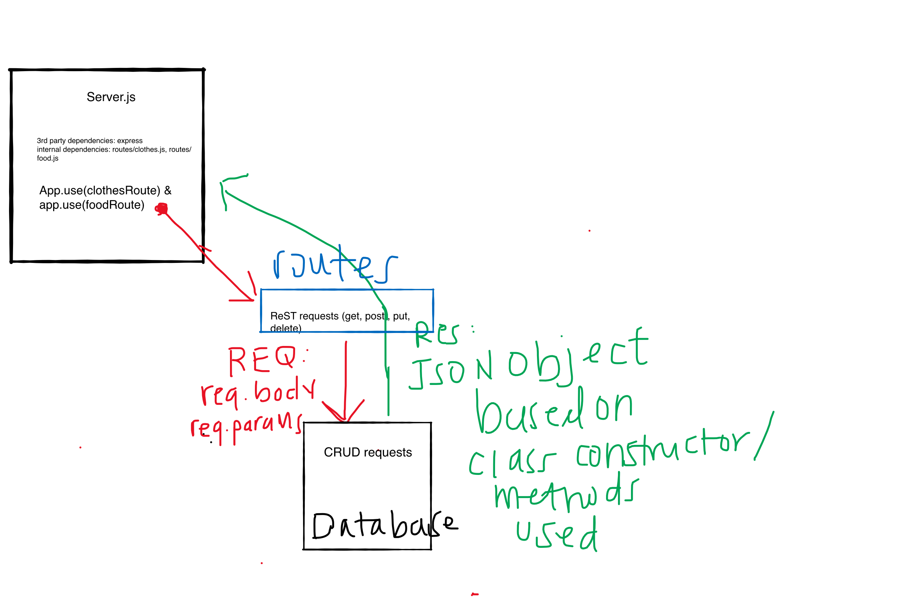

# basic-api-server

**Project:**
Lab 03: Build a Basic API Server

**Author:**
Taylor Thornton

Links and Resources

ci/cd (GitHub Actions)

back-end server url (when applicable)

front-end application (when applicable)

**Setup**
.env requirements (where applicable)
i.e.

PORT - 3333

**How to initialize/run your application (where applicable)**
- Will need to install express, jest, supertest

**Tests**
How do you run tests?
- No tests required on this basic API server

**UML**
;
